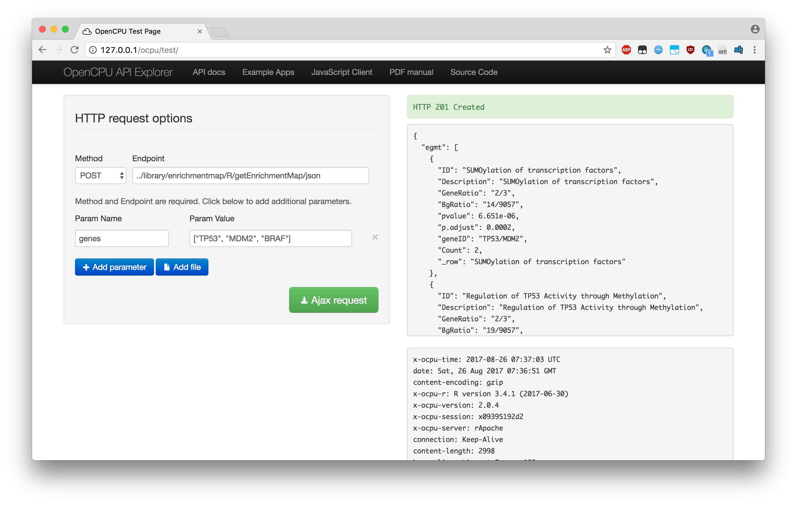

# OpenCPU in Docker

# Build
## Default
```
docker build -t cannin/opencpu:opencpu-2.0 .
docker build -t cannin/opencpu:enrichmentmap -f Dockerfile_enrichmentmap .
```

## Custom Install
```
docker build -t cannin/opencpu:enrichmentmap -f Dockerfile_enrichmentmap .
docker pull cannin/opencpu:enrichmentmap
```

# Run
## Default
```
docker rm -f oc; docker run --name oc -t -p 80:80 -p 8004:8004 cannin/opencpu
docker rm -f oc; docker run --name oc -it -p 80:80 -p 8004:8004 cannin/opencpu bash
docker exec -it oc bash
```

## Custom Container
```
# SKIP: docker rm -f oc; docker run --name oc -t -p 80:80 -p 8004:8004 cannin/opencpu:enrichmentmap
docker rm -f oc; docker run --name oc -it -p 80:80 -p 8004:8004 cannin/opencpu:enrichmentmap apache2ctl -D FOREGROUND
docker rm -f oc; docker run --name oc -it -p 80:80 -p 8004:8004 cannin/opencpu:enrichmentmap bash
docker exec -it oc bash
```

# Call OpenCPU
```
curl http://localhost/ocpu/library/stats/R/rnorm/json -d "n=10&mean=5"
```

# Access output and files
## Public
```
curl http://public.opencpu.org/ocpu/library/stats/R/rnorm -d "n=10&mean=5"
curl http://public.opencpu.org/ocpu/tmp/x09e692cd2c/R/.val
curl http://public.opencpu.org/ocpu/tmp/x09e692cd2c/files/DESCRIPTION
```

## Local/Custom Package
### Generate a table with a set number of rows/columns
```
curl http://localhost/ocpu/library/enrichmentmap/R/getMatrix/json -d "n=100&r=10&c=10"
```

### Call command that creates JSON file
```
curl http://localhost/ocpu/library/enrichmentmap/R/getJson -d "saveFile=TRUE"
```

### Access JSON file
* NOTE: The ID "x06ee947c11" will change. The output from getJson will specify the ID.
```
curl http://localhost/ocpu/tmp/x06ee947c11/R/.val/print
curl http://localhost/ocpu/tmp/x06ee947c11/files/example.json
```

### Access JSON output from function
The output from x can be parsed using JSON.parse()
* NOTE: Without parameters the function is returned
```
x = curl http://localhost/ocpu/library/enrichmentmap/R/getJsonStr/json -d "p=0"
JSON.parse(x)
```

# Run getEnrichmentMap
## Test
* Test at this URL: http://127.0.0.1/ocpu
* URL: ../library/enrichmentmap/R/getEnrichmentMap/json
* Parameter: genes: ["BRAF", "MDM2", "TP53"]
* Request type: POST


